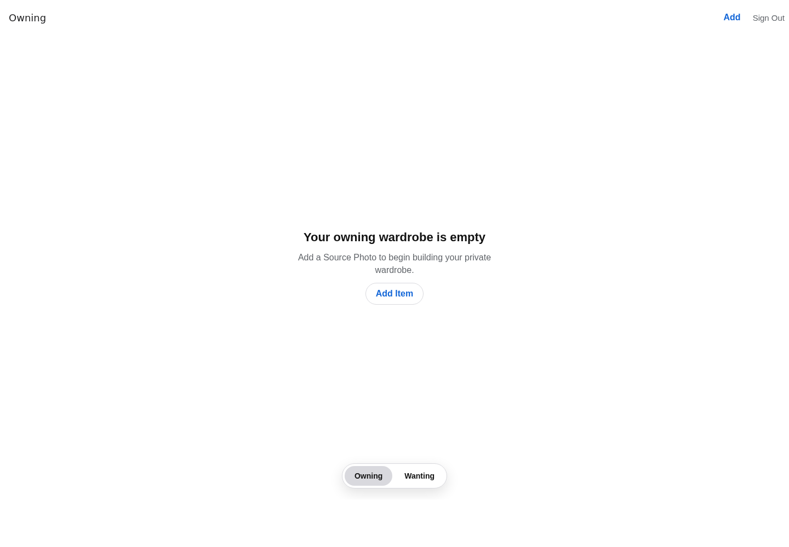

## Question

Replace the Expo starter UI with the authenticated SDK 57 application shell: native Owning and Wanting tabs, nested stacks, iOS-native headers and Add toolbar action, semantic system styling, and appropriate Android/web adaptations.

## Resolution

Replaced the Expo starter surface with an authenticated SDK 57 application boundary. Startup now restores the server session before routing, distinguishes a revoked session from an unreachable service, protects every wardrobe and Add route, and supports administrator credentials, explicit sign-out, browser cookies, and native SecureStore tokens without retaining the native token in React state.

Owning and Wanting now use platform-native bottom tabs with independent nested stacks. iOS receives large native titles, SF Symbols, a native Add toolbar button, and an account menu; Android receives Material symbols and header actions; web receives a responsive, focus-aware tab treatment. Shared semantic colors adapt to each native system and to web light/dark appearance. Add opens through a protected form-sheet/modal route ready for the guided intake ticket.

Removed the remaining Expo starter routes, components, reset utility, and documentation. Mobile verification now covers session-state transitions, typechecks the SDK 57 route and toolbar APIs, and produces the static web export. A scoped Metro resolver preserves the contracts package's Node-compatible `.js` imports while allowing Expo to consume its TypeScript workspace source.

