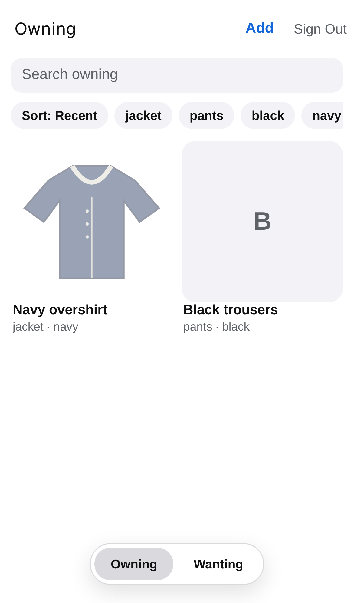
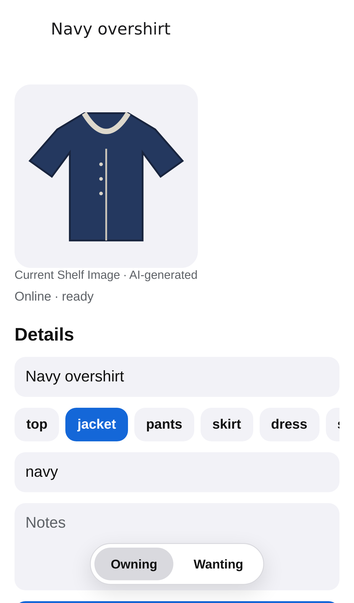
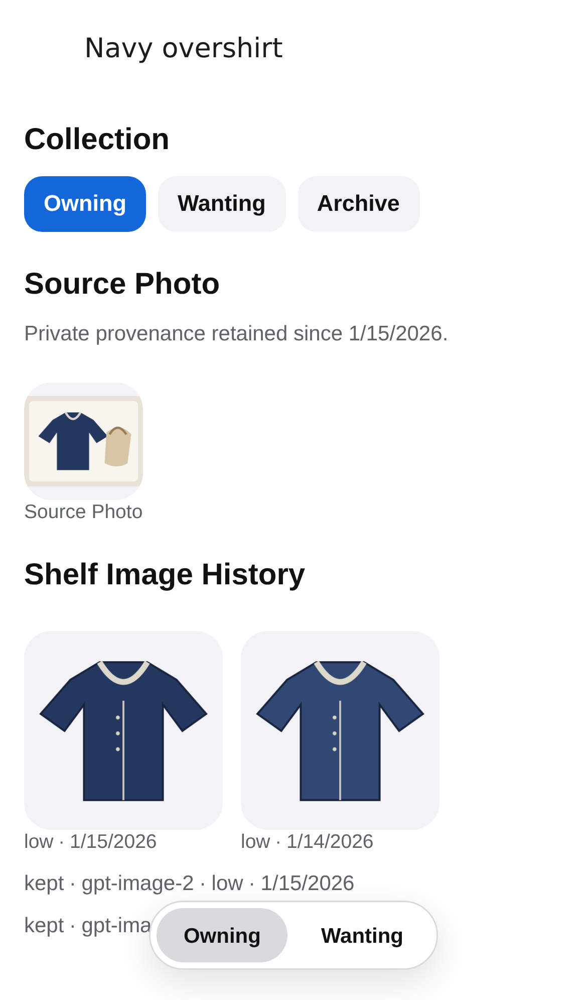

## Question

Implement Owning and Wanting image grids, search, category/color filters, sorting, item details, editable metadata, Source Photo provenance, fullscreen zoomable media, cached reads, and a SQLite-backed outbox for lightweight edits.

## Resolution

Owning and Wanting now render responsive, refreshable Shelf Image grids backed by authenticated wardrobe data. Native iOS headers provide search while Android and web receive an in-content adaptation; shared controls filter by strict category and color and sort by recency, name, or category. Each tile exposes its lifecycle status through the collection, uses private signed media with an asset-stable disk cache key, and marks edits that have not reached the service yet.

Each item has a native detail route with editable name, category, colors, notes, and reversible Owning, Wanting, and Archive controls. Detail pages retain the private Source Photo as visible provenance, show kept Shelf Image and generation history without presenting generated media as extraction, and open source or shelf media through native link affordances into a fullscreen pinch- and double-tap-zoom viewer.

The authenticated client now persists account-scoped lists, item details, histories, and signed-media references. Native builds use Expo SQLite in WAL mode; the web adaptation uses browser storage behind the same repository interface. Lightweight edits are applied optimistically and coalesced by item in a durable outbox while offline, retain one idempotency key and expected record version, replay after reconnection, and surface stale-version conflicts instead of overwriting server state. Online-only work remains outside this boundary.

Mobile tests cover deterministic search/filter/sort behavior and offline edit coalescing. Repository verification typechecks every workspace, runs all unit suites, and successfully produces the Expo static web export.

## Smoke evidence

The repeatable browser smoke test signs the populated fixture account into the real local Hono API, PostgreSQL database, and versioned MinIO bucket. It asserts both Owning items, opens the versioned item detail, verifies Source Photo provenance and both kept `gpt-image-2` attempts, and captures desktop and phone-sized evidence. Fixture media is generated deterministically as recognizable Source Photo, keyed, and transparent Shelf Image inputs rather than 1×1 placeholders.

| Wardrobe grid | Editable detail | Provenance and versions |
| --- | --- | --- |
|  |  |  |

Desktop adaptations are captured in [the grid](../assets/wardrobe-grid-desktop.png), [detail](../assets/wardrobe-detail-desktop.png), and [provenance](../assets/wardrobe-provenance-desktop.png) screenshots.

The deliberate paid OpenAI smoke test also passed against the live strict detection and `gpt-image-2` edit endpoints on 2026-08-04. It validated a returned wearable proposal, provider request IDs, nonzero image input/output usage, and successful chroma-background processing of the generated 816×816 Low-quality result.
